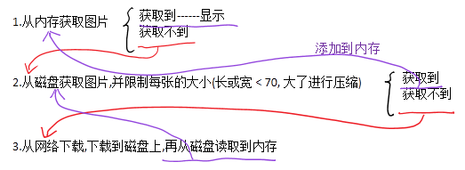
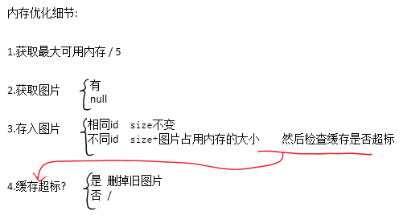
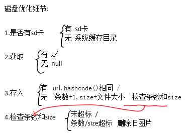

# 案例
---
### getImage From MediaStore or Camera
> 这是关于从相册/相机获取图片的案例:
>> - 从相册获取图片,并且裁剪图片
>> - 从相机获取图片(不能直接剪裁,需要剪裁请调用剪裁代码)
>> - 剪裁图片

### Button
> 这是自定义按钮的案例:
>> - 获取/失去焦点 的方式
>> - 按钮 的方式

### EditText
> 文本输入框案例:
>> - 自定义了输入框背景
>> - 输入文字显示delete按钮
>> - 

### Parcelable
> Parcelable的案例
>> - `public class Bean implements Parcelable { ... }`

### ListView
> ListView的优化
>> - 1.复用convertView;
>> - 2.异步加载网络图片;
>> - 3.快速滑动时不显示图片;
>> - universal-image-loader-1.9.4.jar

### LruCache
> 内存缓存优化和磁盘缓存优化
>> - abc.jpg放在SD卡根目录下
>> - SD卡根目录下的` img2 `文件夹就是该案例的缓存目录
>> - 清理缓存策略全部采用`按访问顺序排序`,访问最少的先清除

>> 针对图片优化的思想:
>> 
>> 
>> 

### AsyncTask
> AsyncTask 线程池案例

### Load Big Image View
> 加载巨幅图画的案例(非缩小式压缩)
> BitmapRegionDecoder类的使用
>> - qingmingshanghetu.jpg放在assets目录下

### XXXGestureDetector
> 手势类工具
> ###### MoveGestureDetector
> 移动手势类
>> - 手指向左滑,-x;向右滑+x;
>> - 手指向上滑,-y;向下滑+y;

### Dialog
> 对话框
> - 使用系统对话框
> - 使用自定义对话框

### Weight
> 自定义控件
> - 自定义属性

### Style
> 样式

### Drawable
> drawable图片

### Animation
> 动画
>> - Acitivity:Activity切换动画
>> - View:View动画

### TwoClickBack
> 两次返回键后退案例

### PopupWindow
> PopupWindow使用的案例

### AppWight
> 桌面Wight的使用案例

### SlidingDrawer
> 滑动抽屉的案例

### ProgressBar
> 自定义进度条样式

### WaterfallListview
> 瀑布流案例

### GalleryFlow
> 画廊流案例

### DragLayout
> 侧滑面板的案例

### QuickIndexBar
> 快速索引条
>> - 用于字母快速定位联系人

### ParallaxListView
> 视差特效listview
>> - 用于空间展示

### SwipeLayout
> 侧拉删除
>> - 用于列表条目管理

### GooCircle
> 粘性圆点
>> - 用于未读提醒 以及清除

### Uncoupled
> 解耦方案
>> -  AbstractClass+ConfigFile
>>> 抽象类 + 配置文件

### CursorAdapter
> CursorAdapter的使用案例
>> - CursorAdapter的自动更新
>> - 原生的操作数据库方式
>> - 内容提供者操作数据库方式
>> - 原生的访问数据库
>> - 异步帮助类访问数据库

