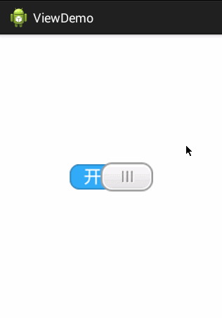

## view
---
> 该目录下存放各种自定义view控件

### LazyViewPager.java
> - 不自动加载第二页page的ViewPage控件

### CustomViewPager.java
> - 不能左右滚动的ViewPager
> - 可以设置是否左右滚动
> - 由于继承`LazyViewPager.java`,所以不会自动加载第二页page,如需自动加载可将其继承为系统的`ViewPager`类

### RollViewPager.java
> - 自动滚动的ViewPager
> - 案例:RollViewPager.java.file
> - 

### ToggleButton
> - 开关按钮
> - 目前控件的大小由设置的图片决定,后续会修正代码
> - 